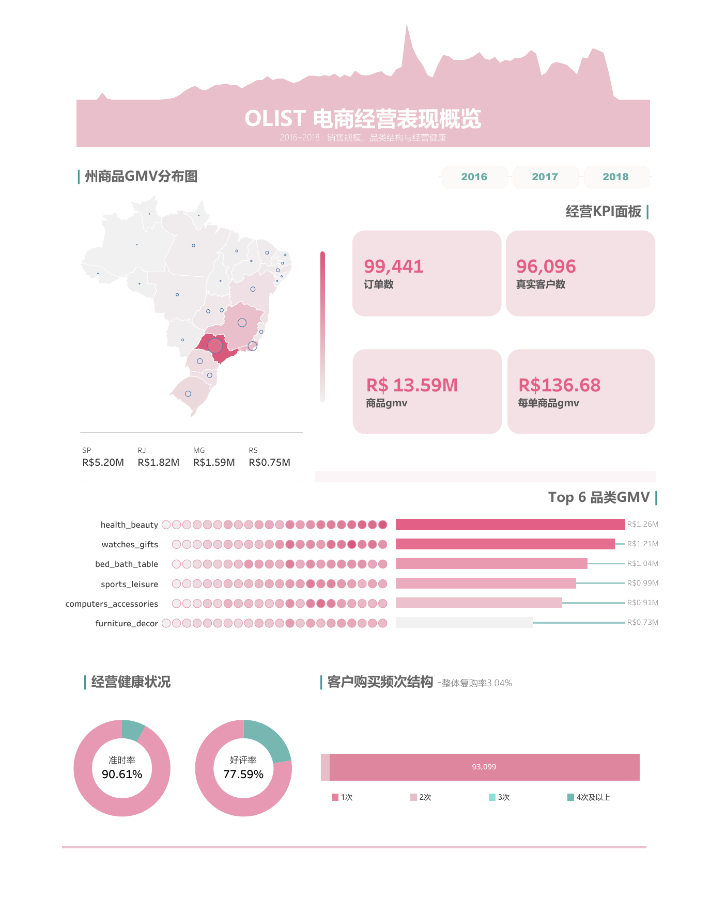

# Olist 电商履约与客户体验分析

基于 Olist 巴西电商公开数据构建的端到端数据分析项目。项目将经营概览与问题诊断分开：Tableau 展示订单、区域、品类与客户结构，HTML + ECharts 解释物流延误与客户差评之间的关联，并给出可执行的预警和治理优先级。

> 数据覆盖 2016–2018 年。本项目用于展示多表建模、统计验证和可视化表达方法，结论仅描述该历史样本，不代表当前巴西电商市场水平。



## 项目入口

- 交互分析页：双击 [`dashboard/index.html`](dashboard/index.html)，无需服务器或网络。
- GitHub Pages：启用 Pages 后，仓库根目录会自动跳转至交互分析页。
- Tableau Public：[在线打开互动看板](https://public.tableau.com/app/profile/z.whisper/viz/olist-business-dashboard/OLIST?publish=yes)。
- Tableau 源文件：[`outputs/tableau/olist-business-dashboard.twb`](outputs/tableau/olist-business-dashboard.twb)。
- 完整分析报告：[`docs/analysis-report.md`](docs/analysis-report.md)。
- 指标口径：[`docs/metrics.md`](docs/metrics.md)。

## 核心结论

- 96,476 笔订单有实际送达时间，其中7,827笔延误，延误率为 **8.11%**。
- 延误订单差评率为 **53.98%**，未延误订单为 **9.19%**，差异为 **44.79 个百分点**。
- 两比例 Z 检验的95%置信区间为 **[43.66, 45.92] 个百分点**，`p < 0.001`，说明这一差距并非随机波动所能合理解释，且约44个百分点的差异具有明确业务意义；但观察性数据不能据此认定为严格因果关系。
- 控制品类、客户州和订单金额后，延误订单产生差评的 odds 约为未延误订单的 **11.65倍**。
- 延误从1–2天进入3–5天后，差评率由25.52%升至56.66%，因此将3天作为候选预警阈值。
- 床品卫浴、健康美容和运动休闲同时具有较高延误规模与体验风险，应优先治理。

以上为观察性分析结果，只支持强关联，不表述为严格因果效应。

## 分析流程

```text
Olist 原始 CSV
    ↓  scripts/00_setup_database.py
DuckDB 原始表
    ↓  scripts/data_cleaning.py
订单级 / 商品级 / 订单×品类级分析视图
    ├─ SQL 经营与履约分析
    ├─ Python 统计验证
    ├─ Tableau 数据导出
    └─ ECharts 轻量数据导出
```

## 数据粒度

| 数据层 | 一行代表什么 | 主要用途 |
|---|---|---|
| `v_order_facts` | 一笔订单 | KPI、客户、金额、评价与履约 |
| `v_order_delivery` | 一笔订单 | 创建、批准、发货、送达阶段 |
| `v_order_delay` | 一笔有实际送达时间的订单 | 延误率与客户体验 |
| `v_order_item_detail` | 一笔订单中的一个商品明细 | GMV、运费与品类销售 |
| `v_order_category` | 一笔订单与一个品类的组合 | 同品类体验比较 |

订单、商品、支付和评价存在一对多关系。项目先分别聚合到订单级再连接，避免直接 JOIN 导致订单数和 GMV 被重复放大。

## 本地运行

### 1. 安装环境

推荐 Python 3.10–3.12。

```bash
python -m venv .venv
# Windows
.venv\Scripts\activate
pip install -r requirements.txt
```

### 2. 下载数据

从 [Brazilian E-Commerce Public Dataset by Olist](https://www.kaggle.com/olistbr/brazilian-ecommerce) 下载数据，并将9个 CSV 放入 `data/raw/`。具体文件名见 [`data/README.md`](data/README.md)。原始数据和本地 DuckDB 不纳入 Git。

### 3. 重建数据库与分析视图

```bash
python scripts/00_setup_database.py
```

### 4. 运行分析与导出

```bash
python scripts/06_run_all_analysis.py
python scripts/05_statistical_validation.py
python scripts/07_export_dashboard_data.py
python scripts/08_export_tableau_data.py
```

### 5. 查看交互页面

直接打开 `dashboard/index.html`。页面使用本地 ECharts 和本地 JS 数据，不依赖 CDN，也不需要 `http.server`。

## 仓库结构

```text
.
├── dashboard/              # HTML/CSS/JavaScript 交互分析页
├── data/
│   ├── raw/                # 原始 CSV，本地保留、Git 忽略
│   └── processed/          # DuckDB，本地生成、Git 忽略
├── docs/                   # 分析报告与指标口径
├── notebooks/              # 数据探索与延误分析
├── outputs/
│   └── tableau/            # Tableau 工作簿及本地导出 CSV
├── scripts/                # 建库、清洗、SQL、统计与导出脚本
├── .gitignore
├── index.html              # GitHub Pages 入口
└── requirements.txt
```

## 技术栈

- SQL / DuckDB：数据建模和业务指标
- Python / pandas：数据处理与导出
- SciPy / Statsmodels：两比例检验和二项 GLM
- Matplotlib / Seaborn：探索性分析
- Tableau：经营概览
- Apache ECharts / HTML / CSS / JavaScript（AI 辅助）：交互式分析叙事

## 结论边界

- 数据为2016–2018年历史公开样本，不能直接代表当前市场。
- 差评定义为评分1–2分；无评价订单不进入差评率分母。
- 多评价订单在订单层按平均评分聚合，这是当前项目的一项简化处理。
- 3天是样本中的候选预警阈值，应用于其他平台或国家时必须重新估计。
- GLM控制了品类、客户州和金额，但仍可能存在卖家、距离、促销等未观测混杂因素。

## 数据来源

Olist, *Brazilian E-Commerce Public Dataset*, Kaggle:

https://www.kaggle.com/olistbr/brazilian-ecommerce
